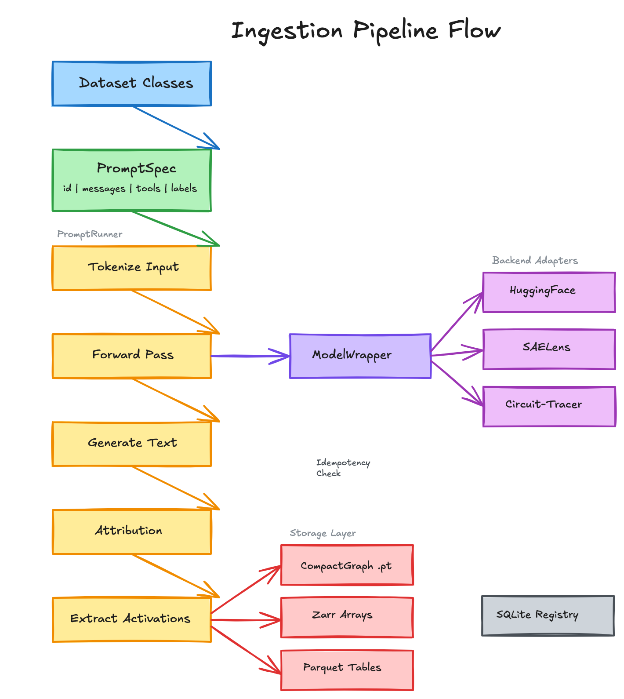

# Prompt Mining

Infrastructure for capturing activations and performing mechanistic interpretability research on LLMs.

## Overview

This platform provides:
- **Activation capture**: Extract and store model activations at various layers/positions
- **Attribution graphs**: Optional circuit_tracer integration for attribution analysis
- **Multi-GPU ingestion**: Scalable, idempotent pipeline for processing datasets
- **Classification**: Cross-dataset generalization with LODO evaluation
- **Analysis tools**: Feature comparison, clustering, and interpretation

## Installation

```bash
pip install -e .
```

### Optional Dependencies

`circuit-tracer`: Required for `circuit_tracer` backend - enables attribution graph capture

Follow the installation instructions on https://github.com/safety-research/circuit-tracer

### Environment Setup

Copy the example environment file and fill in your credentials:

```bash
cp .env.example .env
```

Required variables:
- `HF_TOKEN`: HuggingFace token for model access

Optional (for LLM-based SAE feature interpretation):
- `AWS_ACCESS_KEY_ID`, `AWS_SECRET_ACCESS_KEY`, `AWS_DEFAULT_REGION`: AWS credentials for Bedrock

## Main Components

### Model Layer (`prompt_mining/model/`)

**ModelWrapper** - Unified interface for loading and running models across different backends.

**BackendAdapter** - Abstraction layer supporting three backends:
| Backend | Description | Use Case |
|---------|-------------|----------|
| `huggingface` | HuggingFace transformers with multi-GPU support, SAE encoding | Production inference, broad model support |
| `saelens` | TransformerLens HookedTransformer with SAE | Custom hook points for raw activations (single GPU, limited model support) |
| `circuit_tracer` | ReplacementModel with transcoders | Attribution graph analysis |

All backends provide: `forward()`, `generate()`, `run_with_cache()`, `tokenize()`, and SAE encoding when configured.

### Ingestion Pipeline (`prompt_mining/ingestion/`)



**PromptRunner** - Core execution engine that processes prompts through:
1. Tokenization and generation
2. Optional evaluation (via pluggable Evaluator)
3. Attribution capture (when using circuit_tracer)
4. Activation extraction at specified layers/positions
5. Artifact storage (CompactGraph, Zarr activations, Parquet tables)

**run_ingestion.py** - Multi-GPU orchestrator that schedules dataset jobs across available GPUs with live status display.

**Pipelines**:
- `FullIngestionPipeline` - Complete processing: model inference, generation, evaluation, activation capture
- `LabelsOnlyIngestionPipeline` - Runs evaluator on prompts without model inference (for pre-labeling datasets)

### Datasets (`prompt_mining/datasets/`)

18 dataset implementations including:
- **InjecAgent** - Tool-use attack prompts
- **HFDataset** - Generic HuggingFace dataset loader (base for many others)
- **Safety datasets** - AdvBench, HarmBench, WildJailbreak
- **Instruction datasets** - Dolly15K, OpenOrca
- **Custom datasets** - Bipia, Gandalf, Mosscap, Enron, LLMail, and others

Each dataset produces `PromptSpec` objects with flexible labels for downstream filtering.
HuggingFace datasets (the majority of the existing ones) are easily supported by a thin wrapper class for each new dataset.

### Evaluators (`prompt_mining/evaluators/`, `prompt_mining/core/evaluator.py`)

Evaluators assess prompts and/or model outputs, returning additional labels. They can operate on:
- Prompt only (e.g., classify as malicious/benign)
- Generated output only (e.g., check if model refused)
- Both (e.g., check if output executed an injected instruction)

Available evaluators:
- **InjecAgentEvaluator** - Detects successful/unsuccessful prompt injection attacks
- **PromptGuardEvaluator** - Classifies prompts as malicious/benign
- **LlamaGuardEvaluator** - Safety classification using LlamaGuard
- **LlamaJudgeEvaluator** - Quality judgment using LLM-as-judge

### Inference Pipeline (`prompt_mining/pipeline/`)

**InferencePipeline** - End-to-end pipeline for prompt classification. Orchestrates feature extraction and classifier prediction.

**FeatureExtractors** - Extract features from model activations:
- `SAEFeatureExtractor` - Extract SAE features at specified layer/position
- `RawActivationExtractor` - Extract raw activations

### Classifiers (`prompt_mining/classifiers/`)

**LinearClassifier** - Sklearn-based logistic regression with SGD.

**XGBoostClassifier** - Gradient boosted trees for feature-based classification.

**DANNClassifier** - Domain-Adversarial Neural Network for learning domain-invariant representations. Useful when training data comes from multiple source datasets.

**LODO Evaluation** (`lodo.py`) - Leave-One-Dataset-Out protocol for measuring cross-dataset generalization. Reports per-dataset metrics (accuracy, F1, ROC-AUC).

**Feature Selection** (`feature_selection.py`) - NPMI-based feature selection to identify features that generalize across datasets.

**ClassificationDataset** (`dataset.py`) - Loads activation data from files for training/evaluation.

### Analysis (`prompt_mining/analysis/`)

**AnalysisData** - Lazy-loading data accessor that builds Prompt×Feature matrices from stored artifacts.

**Analyzers**:
- `ComparisonAnalyzer` - PMI and co-occurrence analysis between feature groups
- `DirectionsAnalyzer` - Steering vector computation between conditions
- `UnsupervisedAnalyzer` - PCA dimensionality reduction and clustering

**SAEFeatureInterpreter** - Interpret SAE features using LLM-based descriptions or Neuronpedia lookups.

**AttentionInspector** - Analyze attention patterns across heads and layers.

### Storage & Registry (`prompt_mining/storage/`, `prompt_mining/registry/`)

**LocalStorage** - File system storage with Zarr v3 for activations and PyTorch for CompactGraphs.

**SQLiteRegistry** - Run tracking with idempotency via (run_key, processing_fingerprint). Prevents duplicate processing and supports versioning.

### Core Types (`prompt_mining/core/`)

- **PromptSpec** - Dataset-agnostic prompt with text/chat format and arbitrary labels
- **CompactGraph** - Minimal run artifact (~5KB) with top features and metadata
- **FeatureInfo** - Single sparse feature (layer, position, feature_idx, activation, influence)
- **Evaluator** - Abstract base class for prompt/output evaluation

## Usage

### External Dataset Setup

Two datasets require cloning external repositories before use:

| Dataset | Repository |
|---------|------------|
| **BIPIA** | https://github.com/microsoft/BIPIA |
| **InjecAgent** | https://github.com/uiuc-kang-lab/InjecAgent |

```bash
git clone https://github.com/microsoft/BIPIA.git
git clone https://github.com/uiuc-kang-lab/InjecAgent.git
```

Update the paths in your ingestion config:

```yaml
- name: bipia
  class: BIPIADataset
  params:
    bipia_root: /path/to/BIPIA

- name: injecagent
  class: InjecAgentDataset
  params:
    injecagent_root: /path/to/InjecAgent
```

All other datasets load directly from HuggingFace and require no additional setup.

### Running Ingestion

Entry point: `prompt_mining/ingestion/run_ingestion.py`

```bash
# Multi-GPU orchestration (main entry point)
python -m prompt_mining.ingestion.run_ingestion config.yaml

# Dry run to preview jobs
python -m prompt_mining.ingestion.run_ingestion config.yaml --dry-run

# Override GPU selection
python -m prompt_mining.ingestion.run_ingestion config.yaml --gpus 0,1,2,3

# Single dataset worker (called by orchestrator, or standalone)
python -m prompt_mining.ingestion.ingest --config config.yaml --dataset-name injecagent_dh
```

### Ingestion Modes

The pipeline supports two modes via the `mode` config option:

| Mode | Description | Use Case |
|------|-------------|----------|
| `ingest` (default) | Full processing: model inference, generation, activation capture, evaluation | Primary workflow for capturing activations |
| `labels_only` | Runs evaluator on prompts without model inference | Pre-labeling datasets with Llama Guard, Prompt Guard, etc. |

**Labels-only mode** is useful for:
- Running expensive evaluators (e.g., LlamaGuard) on large datasets before activation capture
- Generating ground-truth labels for classifier training
- Comparing evaluator performance without activation overhead

### Available Evaluators

Evaluators assess prompts and/or model outputs, returning labels stored in `prompt_labels`:

| Evaluator | Input | Output Labels | Description |
|-----------|-------|---------------|-------------|
| `InjecAgentEvaluator` | Prompt + Output | `success: bool` | Detects if model executed injected instruction |
| `PromptGuardEvaluator` | Prompt only | `pg_label: BENIGN\|MALICIOUS` | Meta's Prompt Guard 2 for injection detection |
| `LlamaGuardEvaluator` | Prompt only | `lg_label: SAFE\|UNSAFE` | Llama Guard safety classification |
| `LlamaJudgeEvaluator` | Prompt + Output | `judge_score: float` | LLM-as-judge quality assessment |

### Configuration

Example config (`ingestion_config.yaml`):

```yaml
model:
  name: meta-llama/Llama-3.1-8B-Instruct
  backend: huggingface  # or saelens, circuit_tracer
  sae_configs:
    - sae_release: goodfire-llama-3.1-8b-instruct
      sae_id: layer_19

output_dir: /path/to/output
gpus: [0, 1, 2, 3]
num_gpus: 1  # GPUs per job
mode: ingest  # or labels_only

run:
  max_new_tokens: 100
  capture_acts_raw: [[19, 27], "last"]  # [layers, positions]

datasets:
  - name: injecagent_dh
    class: InjecAgentDataset
    params:
      setting: dh
    evaluator_class: InjecAgentEvaluator
    num_prompts: 1000  # optional limit
```

See `prompt_mining/ingestion/ingestion_config.yaml` for full examples.

### Loading Activations

After ingestion, load activations for training/analysis:

```python
from prompt_mining.classifiers import ClassificationDataset

# Load dataset from ingestion output
dataset = ClassificationDataset.from_path("/path/to/your/ingestion/output")

# Load raw activations (dense, shape: [n_samples, d_model])
data = dataset.load(layer=31, space='raw', position='-5')

# Load SAE features (sparse, shape: [n_samples, d_sae])
data_sae = dataset.load(layer=27, space='sae', position='-5', return_sparse=True)

# Access data
X, y, datasets = data.X, data.y, data.datasets
print(dataset.summary(data))  # Dataset statistics
```

**Load options:**
- `layer`: Model layer index (e.g., 27, 31)
- `space`: `'raw'` for model activations, `'sae'` for SAE-encoded features
- `position`: Token position (`'last'`, `'-5'`, [-5, -4, -3, -2, -1], etc.)
- `return_sparse`: Return scipy sparse matrix (recommended for SAE features)

### Loading Labels Only

For evaluator analysis without loading activations:

```python
# Load only labels (fast, no activation I/O)
labels = dataset.load_labels(filters={'status': 'completed'})

# Each item contains:
# - run_id: Unique run identifier
# - dataset_id: Source dataset name
# - prompt_labels: Dict with evaluator outputs (malicious, lg_label, pg_label, etc.)
```

## Example Notebooks

The `demos/` directory contains usage examples:

| Notebook | Description |
|----------|-------------|
| `01_training_classifiers.ipynb` | Train classifiers on stored activations, LODO evaluation, threshold strategies |
| `02_on_the_fly_classification.ipynb` | Real-time classification with SAE feature interpretation |
| `03_evaluator_analysis.ipynb` | Analyze Llama Guard/Prompt Guard performance vs ground truth |
| `04_activation_visualization.ipynb` | t-SNE/PCA visualization of activations by class and dataset |

## Directory Structure

```
prompt_mining/
├── core/           # PromptSpec, CompactGraph, FeatureInfo, Evaluator
├── model/          # ModelWrapper, BackendAdapter
├── ingestion/      # PromptRunner, pipelines, orchestration, configs
├── datasets/       # Dataset implementations
├── evaluators/     # Evaluators (InjecAgent, LlamaGuard, PromptGuard, LlamaJudge)
├── pipeline/       # InferencePipeline, feature extractors
├── classifiers/    # Linear, XGBoost, DANN, LODO evaluation
├── analysis/       # Analyzers, SAE interpretation, attention
├── storage/        # LocalStorage (Zarr + Parquet)
├── registry/       # SQLite run tracking
└── utils/          # GPU, inference utilities

notebooks/          # Usage examples (see above)
```

## Running Tests

```bash
pytest                                    # All tests
pytest test/unit/ -v                      # Unit tests
pytest --cov=prompt_mining --cov-report=html  # With coverage
```
